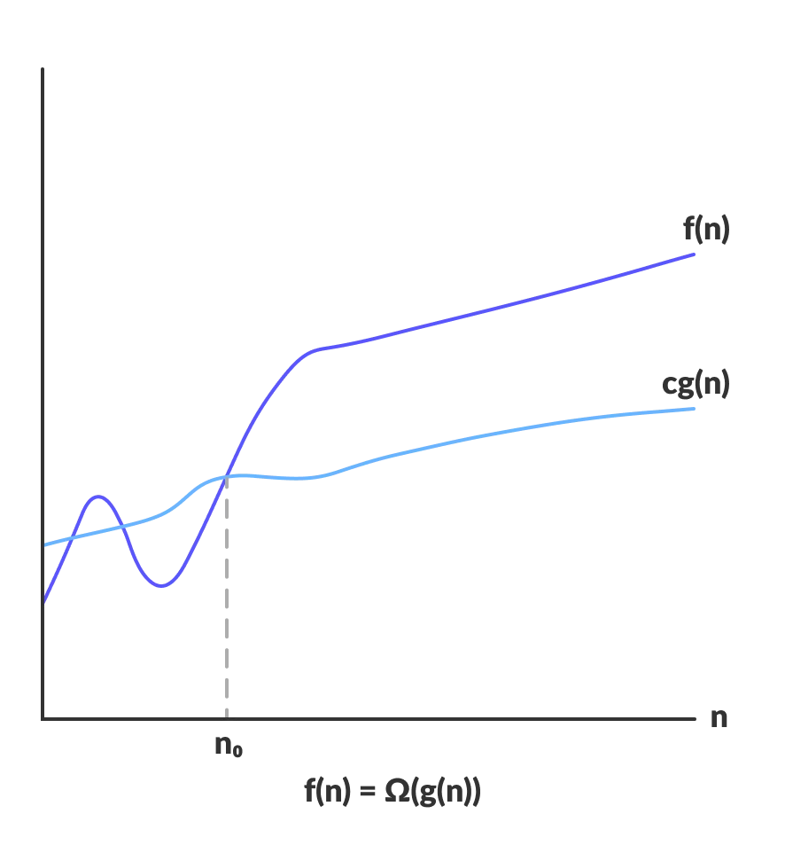
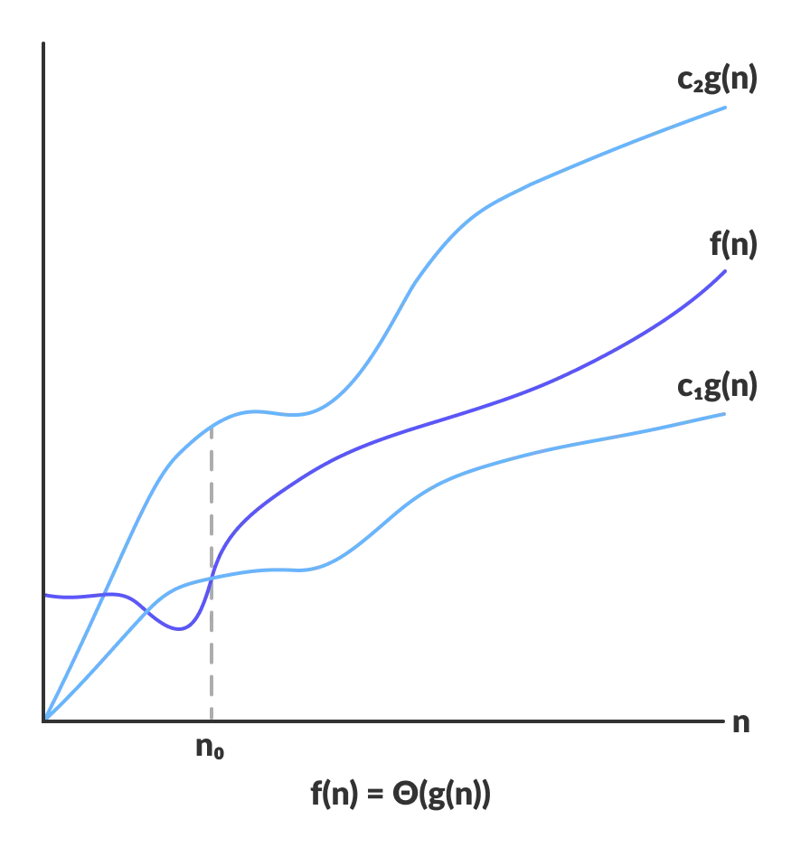
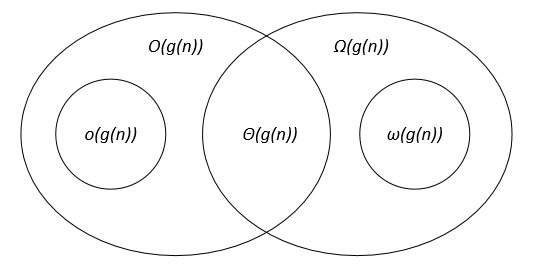

# Asymtotic Notations

* The efficiency of an algorithm depends on amount of time, storage and other resources required to execute the algorithm.
* The efficiency is measured with the help of Asymtotic Notations

## Big O

* Represent **upper bound** of the runtime algorithm.
* It gives **worst case** complexity of an algorithm.

[](big0.png)

>```O(g(n)) = { f(n): there exist positive constants c and n0 such that 0 ≤ f(n) ≤ cg(n) for all n ≥ n0 }```

### Small o OR Little o

* Represent **Tightly upper bound** of the runtime algorithm.

## Big  Ω

* Represent **lower bound** of the runtime algorithm.
* It gives **best case** complexity of an algorithnm.

[](bigomega.png)

>```Ω(g(n)) = { f(n): there exist positive constants c and n0 such that 0 ≤ cg(n) ≤ f(n) for all n ≥ n0 }```

### Small ω or Little ω

* Represent **Tightly lower bound** of the runtime algorithm.

## Theta Θ

* Encloses the function from above and below.
* Represents **upper and lower bound** of runtime an algorithm.
* **Avg case** complexity of an algorithm.

[](theta.png)

## Venn Diag

[](venn_diag.png)

# Master Theorm

>T(n) = aT(n/b) + f(n)
>
>where, T(n) has the following asymptotic bounds:
>
>    1. If f(n) = O(nlogb a-ϵ), then T(n) = Θ(nlogb a).
>
>    2. If f(n) = Θ(nlogb a), then T(n) = Θ(nlogb a * log n).
>
>    3. If f(n) = Ω(nlogb a+ϵ), then T(n) = Θ(f(n)).
>
>ϵ > 0 is a constant.

## Comparison of Various time complexity.

>O(c)<O(loglogn)<O(logn<O)<(n^1/2)<O(n)<O(nlogn)<O(n^2)<O(n^3)<O(n^k)<O(2^n)<O(n^n)<O(2^(2^n))